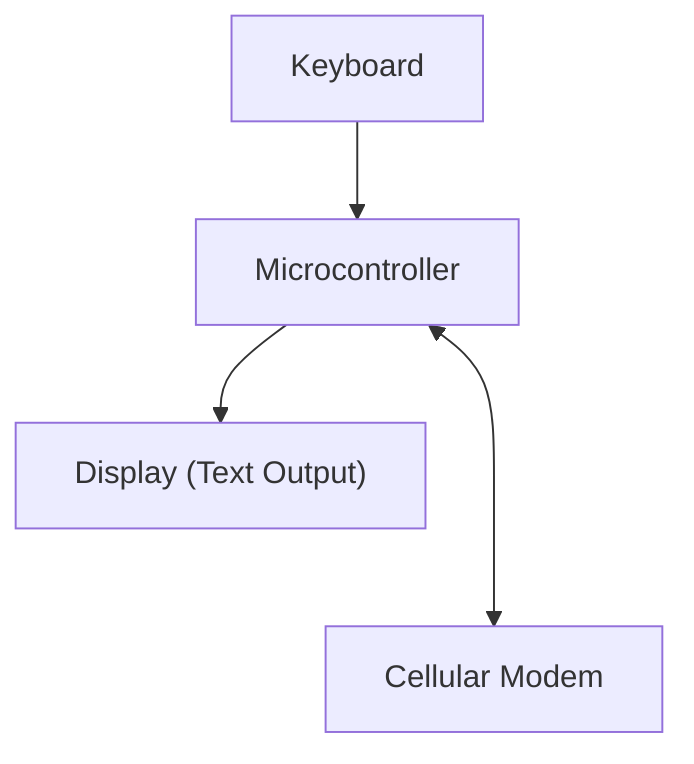

*Concept image generated by ChatGPT*

## Starting a Terminal-Style Cellular Device

I'm starting one of my most ambitious projects yet: **A working geek phone from scratch**.

Smartphones are cool, but they aren't built for the electronics geek:

- Apps decide how you talk
- Notifications decide when you talk
- You can't see anything inside

As someone who likes electronics and computers, I wanted something cooler.

So I asked a simpler question:

**What if a phone worked like a terminal?**

And phones nowadays are full of distracting notifications that in way, **control you**.

---

## The Core Idea

Instead of designing a normal phone, I decided to design a **terminal-style cellular device**.

That means:

- Text only
- Physical buttons
- Clear commands
- No apps
- No touchscreen
- Nothing happens unless I ask for it

---

## Constraints (On Purpose)

Here are some general rules I'm going to set up for this:

- No touchscreen
- No app system
- No multitasking
- No background behavior
- No distracting notifications

So once you remove all the extra features, the device only needs to do a few things:

- Take input
- Send data
- Receive data
- Show system status clearly

That’s the entire job.

---

## Terminal-First Interaction

Everything on this device is through a text interface.

You type commands.
The device responds.

Example:

``` bash
>>> status
NET: CONNECTED
BAT: 82%
```

Sending a message is not in an app — it’s in a text-based command line.

``` bash
>>> text
Retrieving Text Database...

Contacts:
John  :  hey how a...
Anna  :  what?    ...
Kate  :  work time...

Selected John...

John: hey how are you doing?
You: I am doing good.
```

This makes the system:

- COOL!
- Easy to debug
- Easy to understand

---

## High-Level System Diagram

This is the basic idea of how the system works.



---

## Where This Is Going

It’s not meant to be fast or flashy.
And it’s not meant for everyone.

It’s a personal device for me designed to be:

- Geeky
- Cool
- Intentionally different

Future posts will go deeper into:

- Power design
- Input handling
- Terminal UI
- Communication logic

Slow progress is expected..

More soon.
